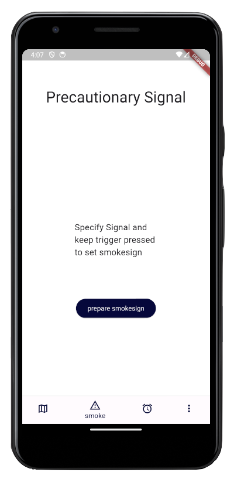
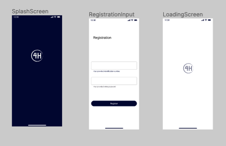
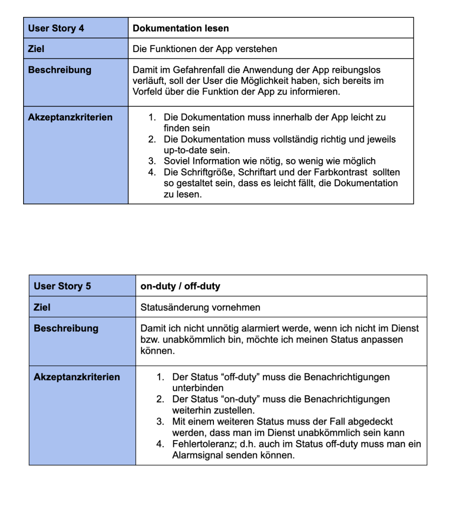

# Project Sheet P12

## 1. About this repo

### This repo is created for an tasksheet but I will also use it to keep track of the actual status of the 4H-App

## 2. The App

### 2.1 Set a Marker on the Map

### 2.2 Manipulate the Marker

### 2.3 Specify your Signal

### 2.4 Plant Signal

### 2.5 Signal Mode

### 2.6 Inform other Devices

### 2.7 Emergency properly handled? Delete your Signal

## 3. The Screens

## 4. The Database Simulation

### -pending-

## 5. My Figma Design

## 6. App overview (Wireframes)

### Hint: I switched to a more minimalistic Design so I created some new Mockups retroactively  

## 7. Personas

## 8. Epics / Userstorys (in German)

